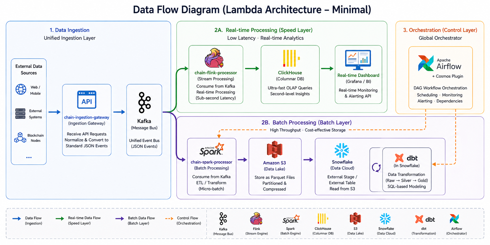
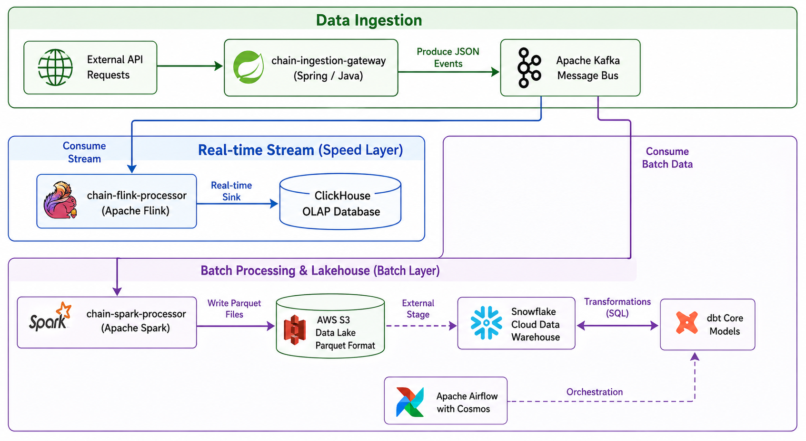

# Chain-Pipeline: A High-Performance Web3 Data Lakehouse

Chain-Pipeline is a robust, modular data engineering project designed to handle high-throughput Web3 transaction data. It implements a **Lambda Architecture** to provide both real-time insights and deep historical analysis, leveraging a Modern Data Stack (MDS).

## 📊 Business Data Flow

> **[Insert Business Data Flow Diagram Here]**
`

The system routes unified API inputs into a bifurcated pipeline: a speed layer for real-time alerting and a batch layer for deep historical transformation.

## 🏗 Technical Architecture



The pipeline is decoupled into several core modules to ensure scalability and maintainability:

* **Ingestion Layer**: `chain-ingestion-gateway` handles data acquisition via external APIs and streams raw JSON events into **Apache Kafka**.
* **Speed Layer (Real-time)**: `chain-flink-processor` consumes Kafka streams for low-latency processing and sinks data into **ClickHouse** for instant OLAP analysis.
* **Batch Layer (Offline)**: `chain-spark-processor` performs micro-batch ingestion from Kafka, converting data into highly compressed **Parquet** files stored in **AWS S3**.
* **Warehouse & Transformation**: **Snowflake** acts as the central compute engine, accessing S3 via External Stages. **dbt (Data Build Tool)** implements a Medallion Architecture (Bronze, Silver, Gold) for structured data modeling.
* **Orchestration**: **Apache Airflow** manages the end-to-end workflow, utilizing **Astronomer Cosmos** to dynamically render dbt models as Airflow tasks.

## 📂 Project Structure

```text
chain-pipeline/
├── chain-common/             # Shared utilities and POJOs
├── chain-ingestion-gateway/  # API-based data ingestion and Kafka producer
├── chain-flink-processor/    # Real-time streaming logic (Kafka to ClickHouse)
├── chain-spark-processor/    # Batch processing logic (Kafka to S3)
├── docker-compose.yml        # Local infrastructure orchestration
└── pom.xml                   # Project dependencies (Maven)
```

## 🚀 Future Evolution Roadmap

This project is currently in its **MVP (Minimum Viable Product)** phase. We have identified a clear trajectory for scaling the system and increasing business value:

1.  **From Ingestion to API Gateway**: The `chain-ingestion-gateway` module will evolve into a full-featured API Gateway. Beyond data fetching, it will incorporate advanced routing, authentication, and rate-limiting to serve as a secure entry point for all blockchain data.
2.  **Real-time Monitoring & Alerting**: We plan to implement specific business logic within the `chain-flink-processor` to build a real-time monitoring system. This will enable instant alerts for anomalous on-chain activities (e.g., flash loan attacks or large-scale transfers).
3.  **Snowflake Performance Optimization**: As data volume scales, we will focus on leveraging Snowflake’s advanced features—such as clustering keys, materialized views, and search optimization services—to ensure cost-effective query performance.
4.  **Advanced dbt Modeling & Governance**: We will enrich the current data flows with more complex business logic and relationships, fully utilizing dbt's testing, documentation, and macro capabilities to demonstrate best-in-class data governance.
5.  **Smart Money & Whale Tracking**: To pivot the MDS layer toward high-value business use cases, we aim to implement a "Whale Wallet Tracking" system, identifying and analyzing the behavior of influential blockchain participants to generate actionable alpha.

## 🛠 Tech Stack

* **Languages**: Java, SQL, Python
* **Streaming**: Apache Kafka, Apache Flink
* **Batch Processing**: Apache Spark
* **Storage & Lakehouse**: AWS S3 (Data Lake), ClickHouse (Real-time OLAP)
* **Data Warehouse**: Snowflake
* **Transformation**: dbt Core
* **Orchestration**: Apache Airflow, Astronomer Cosmos
* **Infrastructure**: Docker & Docker Compose

## 🔧 Getting Started

### Prerequisites
* Docker & Docker Compose
* Java 11+ & Maven
* Snowflake Account (with S3 integration configured)

### Setup & Run
1.  **Infrastructure**: Run `docker-compose up -d` to start Kafka, ClickHouse, and Airflow.
2.  **Ingestion**: Navigate to `chain-ingestion-gateway` and run the Spring Boot application.
3.  **Processors**: Deploy Spark and Flink jobs as per the documentation in their respective directories.
4.  **Orchestration**: Access Airflow UI at `http://localhost:8080` to trigger the `cosmos_web3_smart_money_pipeline`.

---
*Developed as a modular framework for scalable Web3 data processing.*